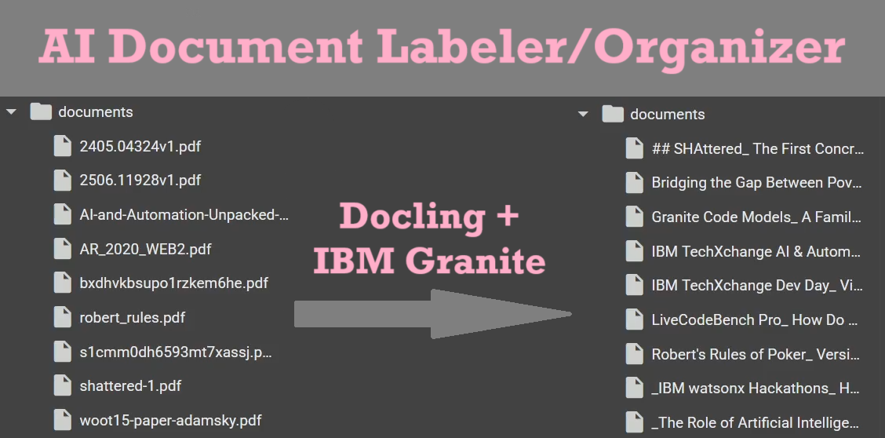

> This project is part of the IBM TechXchange AI & Automation Unpacked Hackathon.

# AI Document Labeler/Organizer

Most documents we receive or download on a regular basis have ambiguous filenames. Having PDFs named things like "Document(1).pdf", "WhatsApp Document 2025-06-28(2).pdf", "IMPORTANT.pdf", and "1706.03762v1.pdf" eventually leads to disaster, since you could never tell that among the thousand random PDFs in your library, "Scanned Document 123.pdf" is that part of your research project that you have a few minutes left to submit before you get in trouble.

LLMs empower computers to understand natural language and generate text based on it, for example: coming up with titles for documents. This project addresses the aforementioned issue by automating the tedious of rummaging through the documents and identifying which file is which. This is done using Docling to convert PDFs to a more "codeable" format, and IBM Granite to determine the document's title and/or topic.

This project uses IBM Granite-3.3-8B-Instruct via watsonx.ai to read, understand, and extract and/or generate the topics of the documents that the project handles.
